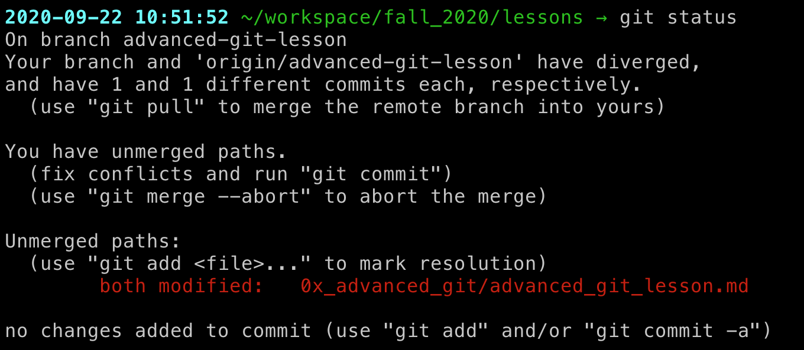
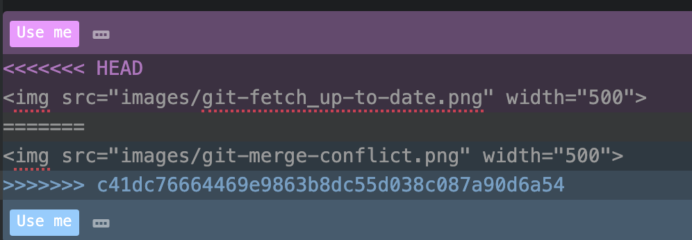
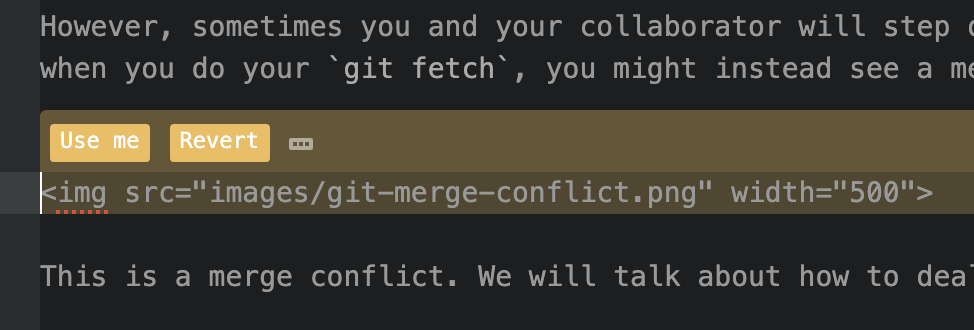

# Git Collab (Pairs) Challenge!

In this challenge, you will:

* Modify your local Git settings to use your preferred text editor
* Add collaborators to a Git repository
* Practice dealing with merge conflicts

## Step 0: Checking your local Git settings
When you first open Git, it is going to make some assumptions about your default preferences. These settings can be viewed by typing `git config --list` from your terminal session.

You can see all possible options for things you could set by typing `git config`.

In the earlier lesson on Git, you used `git config` to modify your username, email address, and preferred text editor. If you have not yet changed the default text editor to your preference, complete the following steps. Otherwise, if you have already done this step, move on to step 1.

Because today you will be working a lot with commit messages, another helpful configuration setting might be to set your default text editor. If you don't do this, Git will usually default to using a command line text editor like [Vim](https://www.vim.org/), [Vi](https://en.wikipedia.org/wiki/Vi), or [emacs](https://www.gnu.org/s/emacs/).

While [some people](https://en.wikipedia.org/wiki/Editor_war#:~:text=vi%20is%20a%20smaller%20and,vim%20is%20almost%20as%20fast.&text=Emacs%20uses%20metakey%20chords.) love these text editors, they can be a bit cumbersome to learn especially when you are new to using terminal.

Luckily, we can configure our Git session to use whatever text editor we prefer. Here is how to do this for VS Code:
-`git config --global core.editor "code --wait"`

A full list for other common text editors can be found [here](http://swcarpentry.github.io/git-novice/02-setup/index.html).

## Step 1: Forking the Git repo for this challenge
In order to practice merge conflicts today, but not mess up any of your existing Git repositories, we're going to fork a repo to work with today.

Since we're working on collaborative coding, you'll want to break into small groups of 2-3 people. 

1. Navigate to [the repo](https://github.com/Justice-Through-Code/merge_conflict_practice). You may need to login to your account.
2. Click the fork button in the top right to fork the repository.

## Step 2: Add 1 new function to the repo on another branch

1. Switch to a new branch using `git checkout -b <branch_name>`.
2.  In the book_class.py file on the new branch, add the `count_books` method:
```
def count_books(self):
  return len(self.books)
```
2. Make sure to add and commit your work.

## Step 3: Switching branches and adding another function
1. Switch back to the main branch using `git checkout main`.
2. In the book_class.py file, add the `remove_title` method:
```
def remove_title(self, title):
  self.books.remove(title)
```
3. Add and commit this work


## Step 4: Creating a merge conflict
1. Now try to merge your branches. On the main branch, run `git merge <branch_name>`. What happens?

## Step 5: Resolving merge conflicts
1. In this case, you  made changes to the same file on two different branches. Now we need to resolve where your workflows have diverged before we can continue.

If you've been reading the Git messages closely, you may have noticed that it is offering you a way forward:


2. If you look at the file in your text editor, you'll notice that the lines where there is a discrepancy are marked with `<<<<<<<` and `>>>>>>>`. This may look different depending on your text editor, but in Atom mine looked something like this:


In order to move forward, you will need to edit the file so that only the text you want in the final version remains. This will also mean removing the tags surrounding the text that marks the zone of conflict.

After making these changes, your file might look something like this:


3. Once you have modified the code in your text editor, you will be able to finish making this commit. 

You can see another example of creating a merge conflict [here.](http://swcarpentry.github.io/git-novice/09-conflict/index.html)


## Step 6: Running the unit test
In the test_books.py file, there is a unit test that will succeed only after you have successfully added both changes and resolved your merge conflicts. Try running it and see what happens!

